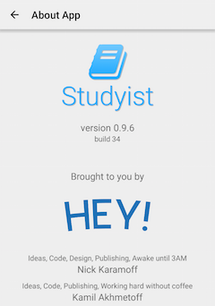
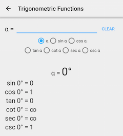

Привет, друзья! Сегодня мы рады представить вам свежую версию нашего приложения Studyist - 0.9.6! Позвольте мне рассказать вам о всех изменениях:

- Добавлены "Тригонометрические функции" (раздел "Геометрия"). Вы можете высчитать все функции угла и даже больше!
- Добавлен пункт "О приложении". Тут вы узнаете чуть больше о нас и о приложении
- Почищен код проекта, были баги с Gradle
- Убрано меню везде, где не нужно (то есть, просто везде)

Обновление уже доступно на официальном сайте приложения: [studyist.nikkeycompany.ru](studyist.nikkeycompany.ru/ru.html#download)

Увидеть изменения можно на скриншотах:

 
 

Оставайтесь с нами, чтобы не пропустить свежайшие новости о нашей компании.